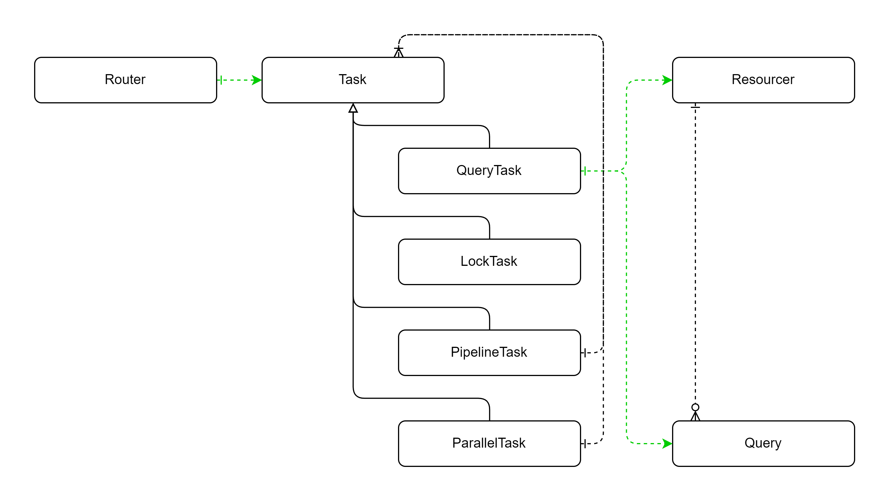

# 프로세스
1. port로 요청이 들어온다.
- user -> handler(controller) -> port
2. port는 요청을 orchestrator로 전달한다.
- port -> orchestrator
3. orchestrator는 router에서 task 정보를 받아온다.
- orchestrator -> router -> orchestrator
4. orchestrator는 task를 실행한다.
    - orchestrator -> task
        - task는 종류마다 처리 방식이 다르다.
        1. QueryTask
            - resourcer와 query 정보를 갖고 요청을 처리한다.
            - resourcer -> (resourcer, query)
            - resourcer는 여러 종류가 될 수 있다.
              - jdbc
              - api(예정)
              - mq(예정)
            - argumentMap을 인자로 받고, 반환한다.
        2. LockTask
            - 락을 얻는다.
            - key lock 방식이다.
            - 락은 비관, 낙관 락이 있다. defalut는 비관락이다.
                - 비관락은 락을 얻을 때까지 대기한다.
                - 낙관락은 락을 얻을 수 없다면 실패한다.
        3. PipelineTask
            - 순차적으로 하위 작업을 처리한다.
        4. ParallelTask(예정)
            - 병렬적으로 하위 작업을 처리한다.
5. orchestrator는 결과를 port로 전달한다.
    - orchestrator -> port
6. port는 응답을 반환한다.
    - port -> user

# core
## 도메인 분류
### router

### resource
#### resourcer
- 자원 제공자
- 매번 JDBC가 의존성에서 구현체를 찾기보다, 
- 자주쓰이는 Resourcer를 캐싱하여 관리

#### argument
- 자원 인자

#### query
- 자원 질의 내용
- 쿼리는 

### task
- 작업
#### lock
- 잠금 작업(키락)
#### pipeline
- 순차적 파이프라인 작업
#### parallel
- 병렬(동시 경합성) 작업
#### QueryTask

## 명칭 분류
### Manager
- 캐시 관리
- 데이터 관리

### Provider
- 데이터 제공

### Repository
- 데이터 저장소

### Domain
- 기능

### Context
- 영속성 데이터
- entity

### dto
#### Command
- 명령
##### CreateCommand
- 신규 객체 생성 명령
##### UpdateCommand
- 객체 수정 명령
#### View
- 전달 객체

## port
- core의 요청점과 응답점

# config
- core를 bean으로 등록(예제)

# infrastructure
- core를 인프라로 구현한 구현체
